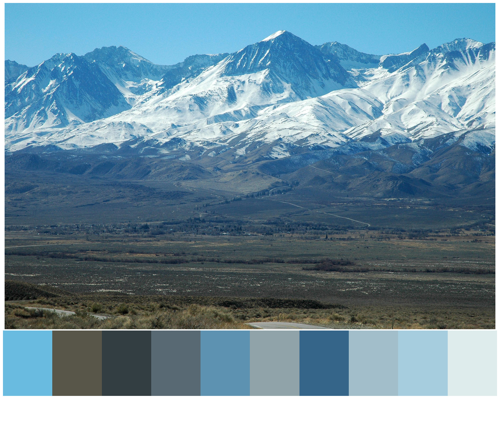
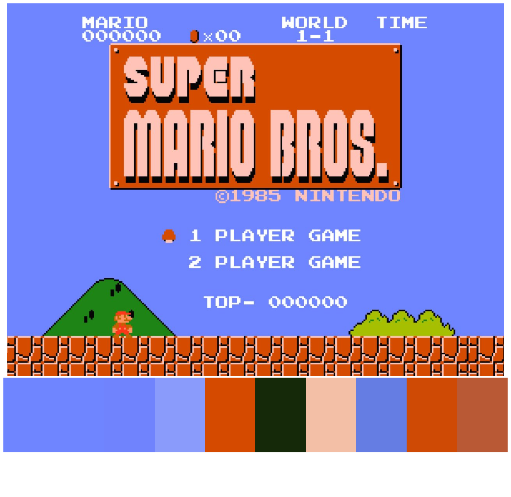

# Median Cut Color Quantization using Python and Pillow


### Installation
```sh
pip install -r requirements.txt
```

### Usage
```python
from PIL import Image
from median_cut import median_cut

img = Image.open('cogs.jpg')
colors = median_cut(img, 10)
img = Image.open('mountain.jpg')
colors = median_cut(img, 10)
img = Image.open('mario.jpg')
colors = median_cut(img, 10)
```

### Output
---


---


---

